<div align="center">

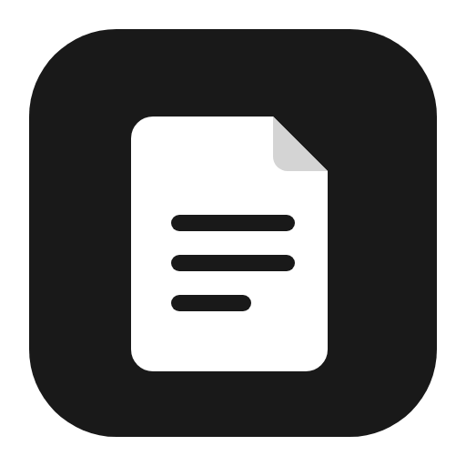

# Workspace

**Notes, docs and databases that live on your computer, sync through your own server, and speak
Notion's API. Notion's core, without the AI.**

[](https://github.com/Ariehant/Workspace/actions/workflows/ci.yml)


[Features](#features) · [Screenshots](#screenshots) · [Get started](#get-started) ·
[Self-host](docs/self-hosting.md) · [API](docs/api.md) · [Docs](docs/README.md) ·
[Roadmap](#roadmap)

<br>

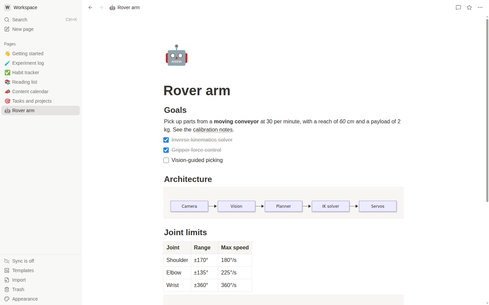

</div>

## Why Workspace

- **Offline first.** The desktop app is complete on its own. Everything is saved locally as you
  type, in one SQLite file, and nothing needs an account.
- **Your server, when you want one.** Add the self-hosted server (Docker Compose behind Caddy) to
  sync devices, work with others in real time, publish pages and use the web app. Edits made
  offline merge cleanly when you reconnect, because every page is a CRDT (Yjs).
- **Notion-compatible.** Import a Notion export, and point existing Notion integrations at your
  server: the official `@notionhq/client` SDK works against it unchanged.
- **No AI, no lock-in.** Export everything as Markdown, CSV, HTML or PDF, or back up the whole
  workspace to a `.zip`.

## Features

<table>
<tr>
<td width="50%" valign="top">

**Editor**

- Slash menu, Markdown shortcuts, drag handles and columns
- Headings, lists, to-dos, toggles, callouts, quotes, tables
- Code with highlighting for ~190 languages, Mermaid diagrams, KaTeX equations
- Images, video, audio, PDFs, files, bookmarks and embeds
- @-mentions of pages, people and dates, reminders, emoji
- Synced blocks, buttons, table of contents, find and replace

</td>
<td width="50%" valign="top">

**Databases**

- Table, board, list, gallery, calendar, timeline, chart and form views
- 20+ property types, with Notion's Formula 2.0 language
- Relations, rollups, sub-items and dependencies
- Filters (nested AND/OR), sorts, groups, calculations per view
- Templates, linked views, locked views, row pages as peeks
- Automations: on a new page, a changed property or a schedule

</td>
</tr>
<tr>
<td valign="top">

**Workspace**

- Page tree with drag and drop, favorites, trash, quick find (`Ctrl+K`)
- Tabs, several windows, back and forward, `workspace://` links
- Backlinks, page history with restore, a templates gallery
- Import Notion exports, Markdown, HTML and CSV
- Export Markdown & CSV, HTML, PDF; full backups
- Light, dark and system themes

</td>
<td valign="top">

**Together, on your server**

- Accounts with passwords or single sign-on (OpenID Connect)
- Members, guests, groups, teamspaces and per-page sharing
- Live cursors and presence, comments, suggested edits
- An inbox for mentions, comments and reminders, with email digests
- Publish pages to the web, and a web app with the same UI
- A Notion-compatible REST API with integration tokens and webhooks

</td>
</tr>
</table>

The full inventory, block by block, is in [docs/features.md](docs/features.md).

## Screenshots

|                                                                                                                                                               |                                                                                                                                                         |
| :-----------------------------------------------------------------------------------------------------------------------------------------------------------: | :-----------------------------------------------------------------------------------------------------------------------------------------------------: |
|                    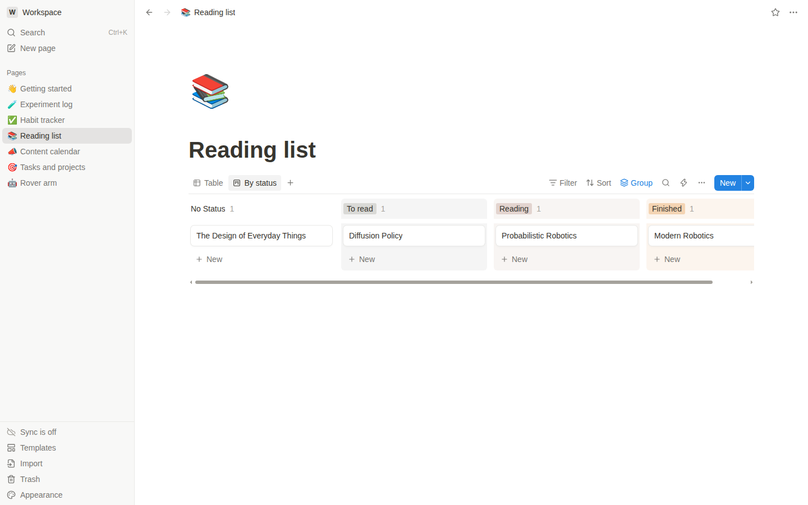<br>**Board view**, grouped by status                    |        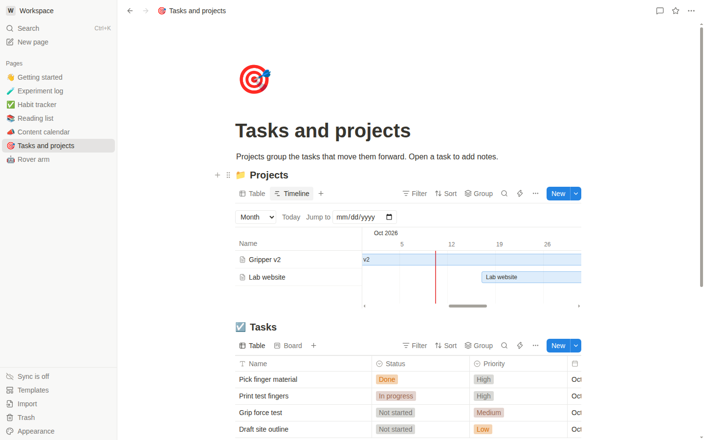<br>**Timeline** and a related table         |
|                  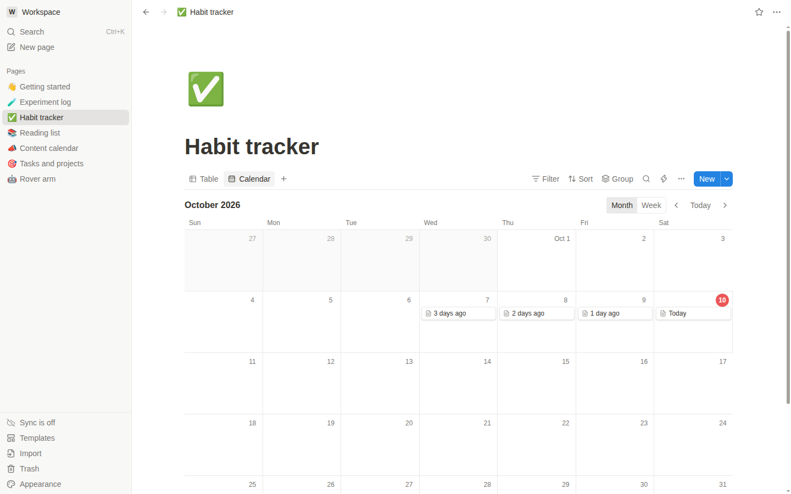<br>**Calendar** of database pages                  |         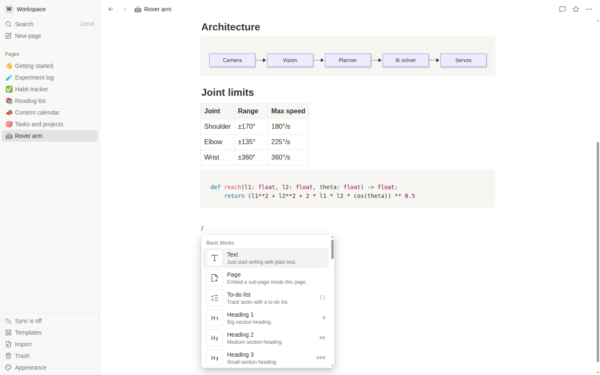<br>**Slash menu** for every block type          |
|              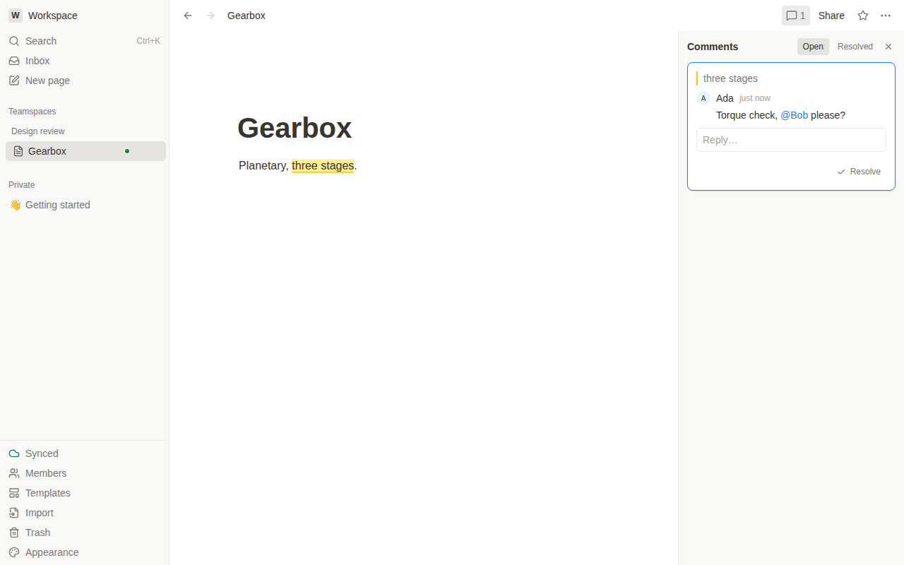<br>**Comments** on text, with mentions               | 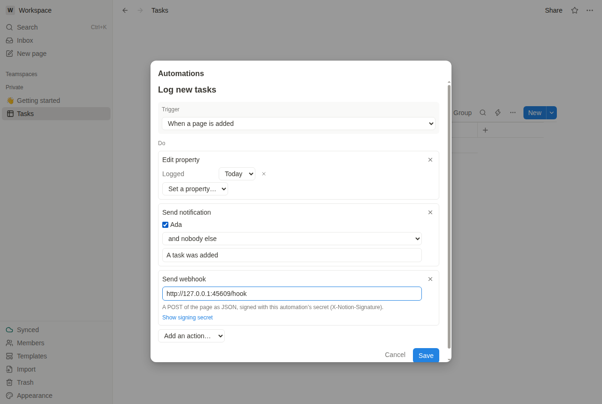<br>**Automations** with webhooks |
| 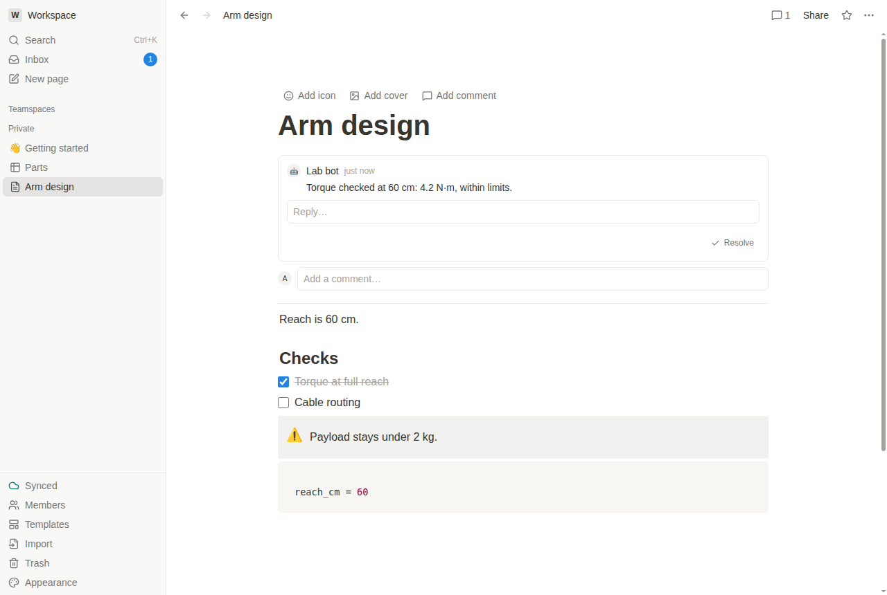<br>Content and comments **from the API**, live |                          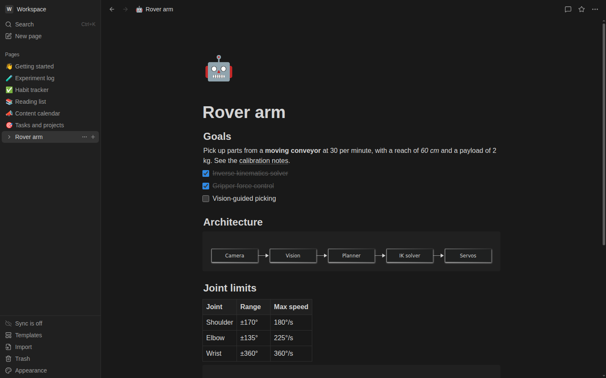<br>**Dark theme**                           |

## Get started

### The desktop app

Workspace runs on Ubuntu 24.04 and later (x86-64). Build the packages from source (there are no
published releases yet):

```sh
corepack enable        # pnpm, at the version the repo pins
pnpm install
pnpm package           # .deb and AppImage in apps/desktop/dist/
sudo apt install ./apps/desktop/dist/workspace-app_*_amd64.deb
```

Prefer the `.deb`: it installs an AppArmor profile so Chromium's sandbox works under Ubuntu
24.04's restrictions. Where your data lives, backups and the AppImage are covered in the
[desktop guide](docs/desktop.md).

### The sync server

```sh
cd infra
cp .env.example .env   # set DOMAIN and POSTGRES_PASSWORD
docker compose up -d
```

Caddy gets a certificate for your domain, and `https://<DOMAIN>` serves the web app. On a
desktop, open **Sync** in the sidebar and enter the same address. The first account becomes the
server admin. Single sign-on, email, S3 storage, backups and the admin CLI are in the
[self-hosting guide](docs/self-hosting.md).

### Use the API

Make an integration in **Members → Integrations**, connect pages to it (**Share → Connections**),
and use Notion's SDK with your server as the base URL:

```js
import { Client } from '@notionhq/client';

const notion = new Client({
  auth: process.env.WORKSPACE_TOKEN,
  baseUrl: 'https://notes.example.com',
});
const { results } = await notion.search({ query: 'Roadmap' });
```

Endpoints, versions, webhooks and the differences from Notion are in the [API guide](docs/api.md).

## Development

You need Node.js 22.13 or later (24 LTS recommended) and pnpm 10 (`corepack enable`).

```sh
pnpm install
pnpm dev               # the desktop app with hot reload
```

| Command             | What it does                                                   |
| ------------------- | -------------------------------------------------------------- |
| `pnpm dev`          | Run the desktop app in development mode                        |
| `pnpm dev:web`      | The web app with hot reload (`VITE_SERVER=<server url>`)       |
| `pnpm build`        | Build every package                                            |
| `pnpm lint`         | ESLint, and a check of every link in the Markdown docs         |
| `pnpm typecheck`    | Type-check every package                                       |
| `pnpm test`         | Unit and integration tests (Vitest, with a throwaway Postgres) |
| `pnpm test:e2e`     | End-to-end tests driving the real Electron app (Playwright)    |
| `pnpm test:e2e:web` | The web app's end-to-end tests (Chromium, real server)         |
| `pnpm format`       | Prettier                                                       |
| `pnpm package`      | Build the `.deb` and AppImage into `apps/desktop/dist/`        |

End-to-end tests need a display: on a headless machine, run `pnpm --filter @workspace/desktop
build`, then `xvfb-run -a pnpm test:e2e`. See [CONTRIBUTING.md](CONTRIBUTING.md) for how the
repo is organised and what a change needs before it's merged.

## Architecture

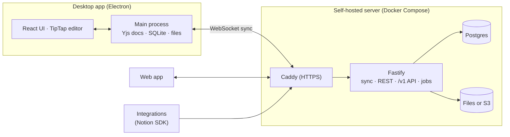

- **Every page and database is a Yjs document.** Concurrent and offline edits always merge, so
  sync and real-time collaboration are additions, not rewrites.
- **The desktop's main process owns the data.** It keeps live documents, appends each update to
  SQLite (`node:sqlite`, with FTS5 search) and relays it to windows, which are sandboxed and use
  a typed preload API.
- **The server checks every write.** Sync messages are authorized per document and per role, and
  the API, forms and automations edit documents through the same checks.
- **One UI, two hosts.** `packages/app` reaches its host only through a `Platform` interface, so
  the desktop and the web app share every screen.

| Path                      | What's there                                                        |
| ------------------------- | ------------------------------------------------------------------- |
| `apps/desktop`            | Electron main process, preload bridge, packaging, E2E tests         |
| `apps/server`             | The server: auth, sync, search, files, the `/v1` API, jobs          |
| `apps/web`                | The web app: the shared UI served by the server                     |
| `packages/core`           | The data model on Yjs: pages, the page tree, blocks, comments       |
| `packages/editor`         | TipTap extensions for every block type                              |
| `packages/database`       | Properties, formulas, filters, sorts, views, automations            |
| `packages/app`            | Shared React screens: sidebar, pages, databases, settings           |
| `packages/ui`             | Design tokens, themes and components                                |
| `packages/storage-local`  | SQLite persistence and search for the desktop                       |
| `packages/storage-remote` | Postgres store for the server: migrations, the update log, accounts |
| `packages/sync`           | The sync protocol: messages, the server hub and clients             |
| `packages/api-model`      | Notion's API objects, both ways                                     |
| `packages/importers`      | Notion exports, Markdown, HTML, CSV                                 |
| `packages/exporters`      | Markdown, CSV, HTML, PDF and backups                                |
| `infra`                   | Docker Compose stack, Caddyfile, systemd unit, backup script        |

The design decisions and their reasons are in [docs/PLAN.md](docs/PLAN.md#1-architecture).

## Roadmap

| Phase                        | Status         | Plan and notes                            |
| ---------------------------- | -------------- | ----------------------------------------- |
| 0. Foundation                | ✅ Done        | [PLAN.md](docs/PLAN.md#8-phase-0-outcome) |
| 1. Editor and navigation     | ✅ Done        | [PHASE1.md](docs/PHASE1.md)               |
| 2. Databases                 | ✅ Done        | [PHASE2.md](docs/PHASE2.md)               |
| 3. Power features            | ✅ Done        | [PHASE3.md](docs/PHASE3.md)               |
| 4. Sync server               | ✅ Done        | [PHASE4.md](docs/PHASE4.md)               |
| 5. Collaboration             | ✅ Done        | [PHASE5.md](docs/PHASE5.md)               |
| 6. Automations and API       | ✅ Done        | [PHASE6.md](docs/PHASE6.md)               |
| 7. Polish and release (v1.0) | 🚧 In progress | [PHASE7.md](docs/PHASE7.md)               |

Out of scope: Notion AI, Notion Mail, Notion Calendar as a separate app, and the marketplace.

## License

No license has been chosen yet, so the code is not yet available for reuse. A license is part of
the v1.0 release ([Phase 7](docs/PHASE7.md)).
